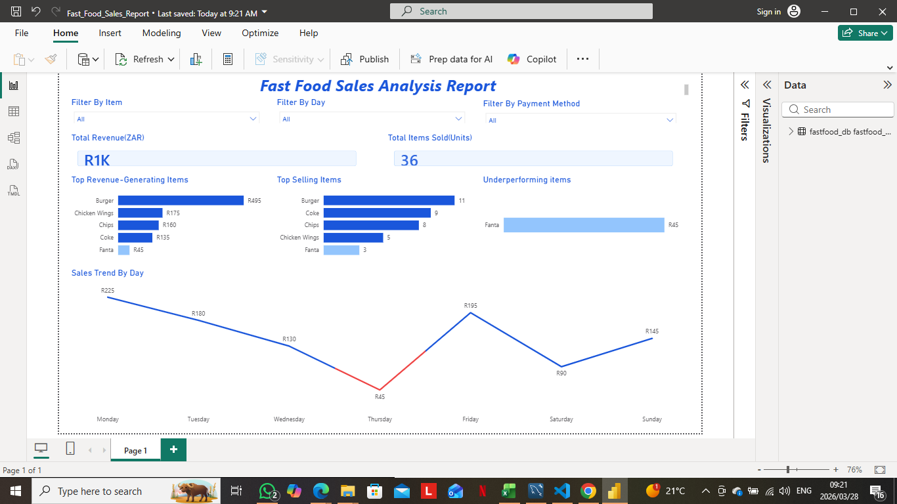

# Fast Food Sales Dashboard

## Project Overview
This project presents an end-to-end data analysis pipeline for a fast food business. The goal is to analyze sales performance, identify top-performing items, and uncover trends to support business decision-making.

---

## Tools & Technologies
- **Python (Pandas)** – Data cleaning and preprocessing  
- **MySQL** – Data storage and querying  
- **Power BI** – Data visualization and dashboard creation  

---

## Project Structure
- `data/` → Raw and cleaned datasets  
- `src/` → Python scripts for cleaning and loading data  
- `sql/` → SQL queries for business analysis  
- `report/` → Power BI dashboard and visuals  

---

## Key Business Questions
- Which menu items generate the most revenue?
- Which items sell the most quantity?
- Which days generate the most sales?
- Which items are underperforming?

---

## Dashboard Preview

---

##  Key Insights
- Burger generates the highest revenue  
- Burger is the most sold item by quantity  
- Fanta is the lowest-performing item due to low demand  
- Sales vary significantly across different days of the week  

---

##  How to Run This Project
1. Run the Python scripts in `src/` to clean the data  
2. Load the cleaned dataset into MySQL  
3. Use SQL queries in `sql/` for analysis  
4. Connect Power BI to MySQL to build the dashboard  

---

## Skills Demonstrated
- Data Cleaning & Transformation  
- SQL Querying & Analysis  
- Data Visualization  
- Business Insight Generation  

